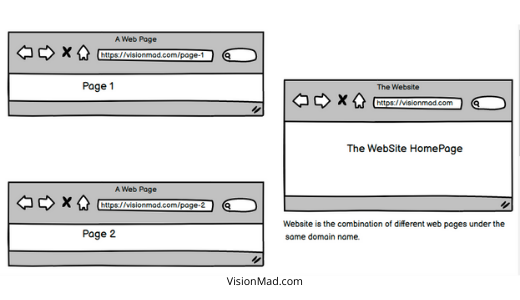
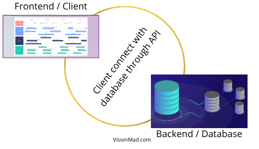

In this lesson, you will get yourself familiar with web development, different technologies used for developing the web, along with environment you need to start web development.

- Why one should learn web development?
- What is web development?
- What are websites and webpages?
- Types of web development.
- Environment setup for web development.

## Why web development?
Web development is a skill that is here to stay. Technologies will come and go but websites are not going anywhere. With time more people and businesses are going to need websites and softwares.

The demand for good web developers is very high but the supply of employable web developers is low.

Employment of web developers and digital designers is projected to grow 8 percent from 2019 to 2029, much faster than the average for all occupations. Demand will be driven by the continued popularity of mobile devices and e-commerce.

## What is web development?
Web development is the process of building websites and webpages. And the professionals who are responsible for developing the web are known as web developers.

## What are websites and webpages?
A website is a collection of different webpages under the same domain. For example, you are reading this lesson on a webpage under the domain of visionmad.com. Here visionmad.com is the website and visionmad.com/curriculum/html-css/intro-to-web-development is a webpage.

## Types of web development.
There are 3 types of web development. Frontend development, Backend development, and Full-stack web development. Let's understand the role of each type of web development.

### What is frontend development?

Frontend web development is what the final user sees. It is about the UI / UX of a webpage. Frontend developers are responsible for how a webpage looks and feel. They request CRUD operations and show it in an easy-to-understand format. The main job of the frontend development is to handle forms and inputs.

#### Technologies used for front-end web development.
- HTML
- CSS
- JavaScript
- ReactJS
- AngularJS
- VueJS

At this point you should not be concerned about the above technologies other than HTML and CSS.

### What is backend development?

Backend development is all about building APIs and managing CRUD (Create, Read, Update, Delete) operations. Backend development is responsible for creating, reading, updating, and deleting the records which will be consumed or used by the frontend.

#### Technologies used for backend web development.
- NodeJS
- Ruby
- PHP
- Python

These are just a few technologies to name. In our full-stack curriculum, we will cover NodeJS instead of old technologies like PHP, Python, or Ruby.

### What is full-stack web development?

Frontend development + Backend development = FullSstack development.

A full-stack developer is responsible to build the frontend, backend and make them talk to each other through APIs.

#### Technologies used for full-stack web development.
- MERN stack
- MEAN stack
- MEVN stack

Don't worry about any of these stacks at this point. They are mentioned just for the sake of completion.

## Environment setup for web development.
As web developers, we need to set up our environment before we can start building webpages. We need a code editor to write code, and a web browser to check our work.

### Code Editor
Code editors are used for writing and structuring our code. Here are a few popular code editors.

- [Brackets](http://brackets.io/)
- [Atom](https://atom.io/)
- [Sublime text](https://www.sublimetext.com/)
- [Visual Studio Code (Recommended)](https://code.visualstudio.com/)

I recommend you to use VS Code as it is used by the majority of professional developers. For your system-specific installation guide visit the official website of these code editors.

### Web Browser
A web browser is simply an application to access the world wide web (The Internet). You must be already using a browser to read this lesson.

The two most widely used web browsers by developers are:

- [Google Chrome](https://www.google.com/intl/en_in/chrome/)
- [Mozilla Firefox](https://www.mozilla.org/en-US/firefox/new/)

These two are the most modern browsers with a lot of features for web developers.

That was a simple introduction to web development. I hope it helped you understand what is web development. Next, we will start learning about HTML and CSS which are building blocks of any webpage.

Please support us by sharing this content.