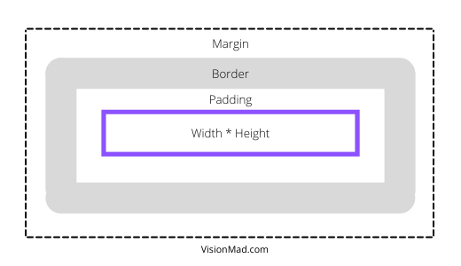

The box model is one of the most confusing concepts of HTML and CSS. But it should not be and it won't be after this lesson.

## What is the box model?
According to the box model every element on the web page is treated as a rectangular box. And that rectangular box can be manipulated using different box model properties. Some popular box model properties are **width, height, margin, border, and padding**.

Here is our portfolio_project. I have added border to elements to visualize the box model. Borders are colored red, green, blue, and hotpink to make it easier to visualize.

<iframe src="https://codesandbox.io/embed/visionmad-portfolio-project-the-box-model-example-n1j18?fontsize=14&hidenavigation=1&theme=dark"
  style="width:100%; height:500px; border:0; border-radius: 4px; overflow:hidden;"
  title="VisionMad - Portfolio Project the box model example"
  allow="accelerometer; ambient-light-sensor; camera; encrypted-media; geolocation; gyroscope; hid; microphone; midi; payment; usb; vr; xr-spatial-tracking"
  sandbox="allow-forms allow-modals allow-popups allow-presentation allow-same-origin allow-scripts"
></iframe>

## The box model properties.
The size of an element begins with the **width and height** properties, and then any **margin, padding, or border** property values are added from there. By default the box model is additive in nature.

### **Margin**
Margin is used to provide spaces around an element. Margin falls outside of the border and is transparent.

```css
div {
  margin: 20px;
}
```

The above code snippet will add 20px of space on all four sides of the div. You can also add space on any specific side of the div. See below code snippet.

```css
.div1 {
  margin-top: 20px;
}

.div2 {
  margin-right: 20px;
}

.div3 {
  margin-bottom: 20px;
}

.div4 {
  margin-left: 20px;
}
```

There is also a short hand to define spacing on all four side in one line. For the short hand of margin define **top, right, bottom, and left** spacing in one line and in the same order.

```css
.div1 {
  margin: 20px 15px 25px 10px;
}

.div2 {
  margin: 10px 30px 10px 30px;
}
```

When top-bottom and left-right margins are same just like the second example in above snippet, you can define just two units one for top-bottom and one for left-right.

```css
div {
  margin: 10px 30px; /*10px for top and bottom. 30px for left and right*/
}
```

### **Border**
Borders provide an outline around an element and falls between margin and padding. The border property requires three values **width, style, and color**. Border styles are of various kinds, most commonly used are **solid, double, dashed, and dotted**. Below is a live example.

HTML

```html
<div class="box box1"></div>
<div class="box box2"></div>
<div class="box box3"></div>
<div class="box box4"></div>
```
Here I have used multiple classes. The ```box``` class will target all the div and ```box1, box2, box3, and box4``` are to target indivisual divs.

CSS

```css
.box {
  width: 50px;
  height: 50px;
  margin: 10px;
  display: inline-block;
}

.box1 {
  border: 6px solid black;
}

.box2 {
  border: 6px double red;
}

.box3 {
  border: 6px dashed green;
}

.box4 {
  border: 6px dotted blue;
}
```

RESULT
<iframe src="https://codesandbox.io/embed/borders-jr4yk?fontsize=14&hidenavigation=1&theme=dark"
  style="width:100%; height:500px; border:0; border-radius: 4px; overflow:hidden;"
  title="borders"
  allow="accelerometer; ambient-light-sensor; camera; encrypted-media; geolocation; gyroscope; hid; microphone; midi; payment; usb; vr; xr-spatial-tracking"
  sandbox="allow-forms allow-modals allow-popups allow-presentation allow-same-origin allow-scripts"
></iframe>

#### **Border Radius**
Border radius is pretty intresting. You can manipulate the shape of the div or any other element from recatngular box to a circle. Giving 50% value to the border-radius property will make the element a perfect circle given that width and height of the element is same.

```css
div {
  border-radius: 50%;
}
```

You can and should experiment by giving different values to the border-radius property. And you are not limited to the % unit, also try using the px unit.

### **Padding**
Padding is used to add spaces within the element. It falls inside of the border. Working with padding is similar to that of margin in terms of syntax and values.

```css
/*20px padding on all four sides*/
.div1 {
  padding: 20px;
}

/*Short hand - top right bottom left*/
.div2 {
  padding: 20px 10px 30px 15px;
}

/*Short hand - 10px for top and bottom. 15px for left and right*/
.div3 {
  padding: 10px 15px;
}
```

**Visualizing the Box Model**


## Total width and height of the box.
Total width of the box can be calculated using the following formula.

>margin-left + border-left + padding-left + width + padding-right + border-right + margin-right.

And, total height of the box can be calculated with the following formula.

>margin-top + border-top + padding-top + height + padding-bottom + border-bottom + margin-bottom.

## The Box Sizing
You know that the box model is additive by default. Any margin, border, or padding will be added to its final width and height. But you can change this behaviour with the box-sizing property.

For example if a div is 100px wide and it has 10px margin, 10px padding, and 2px border on all sides, the final width becomes 144px.

With box sizing you can add padding and border without increasing the size of the div (keeping it 100px only). However any margin will still be added to the final width and height.

The box sizing property have two major values **content-box** and **border-box**.

### **Content Box**
Content Box is the default setting of box sizing which is being additive in nature. So, there isn't any catch here.

```css
/*Default setting*/
div {
  box-sizing: content-box;
}
```

### **Border Box**
With border box as the value of box-sizing property, any padding or border will not be added to the size of the element. However any margin will still be added to the size of the element.

Border Box makes the content shrink propotionally to the padding and border.

```css
/*Setting to border-box*/
div {
  box-sizing: border-box;
}
```

Here is how total width and height is calculated when box-sizing is set to border-box.

Total Width
> margin-left + width + margin-right

Total height
> margin-top + height + margin-bottom

## The Portfolio Project.
Now let's apply our learnings to the portfolio project and make it look better. Here I have added the CSS and explained the changes in snippet itself via comments.

Comments are the texts which gets ignored by the editor. It can be used to add some explanation or additional information. **But it should not be overused. Try to keep things simple.**

In CSS comments are written between (```/*```) and (```*/```). And in HTML it is written between (<--) and (-->).

Index.html
```html
<-- Comment: Added list of projects on the index page right before the footer -->

<ul>
  <li class="project-link">
    <a href="https://swastikyadav.github.io/paradigm-shift/" target="_blank"
      >Paradigm Shift - HTML CSS project</a
    >
  </li>
  <li class="project-link">
    <a
      href="https://swastikyadav.github.io/threshold/index.html"
      target="_blank"
      >Threshold - HTML CSS project</a
    >
  </li>
  <li class="project-link">
    <a
      href="https://swastikyadav.github.io/flexbox-project-2/index.html"
      target="_blank"
      >Prism - Flexbox Project</a
    >
  </li>
</ul>

<footer>...</footer>
```

styles.css
```css
header {
  /* Added space within top and bottom of header */
  padding: 10px 0;
  /* Added border to the bottom of the header */
  border-bottom: 1px solid black;
}

/* Combination of 3 type selectors */
header nav a {
  /* Set display to inline-block. So that top and bottom margin is set */
  display: inline-block;
  margin: 5px;
}

.profile_photo {
  /* Added 20px margin to top and bottom of the image */
  margin: 20px 0;
  /* Made profile photo circular */
  border-radius: 50%;
}

.intro-text {
  margin: 10px 0 20px 0;
  /* Added gap of 1.4 between two lines of text. More on this in typography lesson. */
  line-height: 1.4;
}

footer {
  margin-top: 30px;
  padding: 10px 0;
  border-top: 1px solid black;
}

.page-title {
  font-size: 25px;
  margin: 20px 0;
}

/* List of projects and blogs targeted with class name */
.project-link,
.blog-link {
  margin: 10px 0;
}

```

And, here is the result. It looks much better and clean than before.

<iframe src="https://codesandbox.io/embed/visionmad-portfolio-project-3-2ugxj?fontsize=14&hidenavigation=1&theme=dark"
  style="width:100%; height:500px; border:0; border-radius: 4px; overflow:hidden;"
  title="VisionMad - Portfolio Project 3"
  allow="accelerometer; ambient-light-sensor; camera; encrypted-media; geolocation; gyroscope; hid; microphone; midi; payment; usb; vr; xr-spatial-tracking"
  sandbox="allow-forms allow-modals allow-popups allow-presentation allow-same-origin allow-scripts"
></iframe>

<hr />

This might have been an overwhelming lesson, but this is the most important lesson to understand in HTML and CSS. So please take your time to make these concepts firm in your mind.

And if you want us to keep making content like this then please share it.

Thank you for reading.