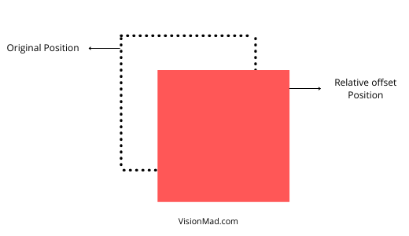
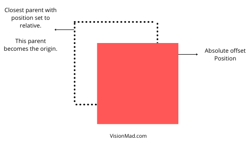
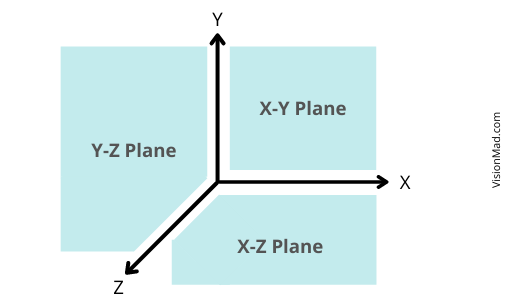

In the last lesson you learned that every HTML element is treated as a box on the browser. So, now let's discuss how we can position and move these boxes around the web page with CSS positioning.

## CSS position property.
To move HTML elements around the page CSS position property is used. It accepts various values like **static, relative, absolute, and fixed**. These values change the flow of the element on the page.

To be able to position elements, you also need to know about box offset properties which we will discuss in a while. It defines: ```In which direction and by how much unit the box should move.```.

Let's study each type of positioning one by one.

### **Position Static**
Static is the default value of any element's position property. Static element exists in the normal flow of page and it doesn't accept any box offset properties.

```css
section {
  position: static;
}
```

### **Position Relative**
Relative element appears within the normal flow of the page, but it allows box offset properties. Box offset properties are applied with element's original position as the origin.

```CSS
div {
  width: 80px;
  height: 80px;
  position: relative;
  top: 20px;
  left: 20px;
}
```

**```left: 20px;```** pushes the element 20px to the right and **```top: 20px;```** pushes the element 20px down from its original position.



### **Position Absolute**
Absolute element does not appear in the normal flow of the page. Absolutely positioned element moves in relation to the closest relatively positioned parent. If no parent is positioned relatively, then the element moves in relation to the **```<body>```**.

So, simply put:

```For an absolute element the box offset properties are applied with the``` **``` closest relative parent ```** ```as origin. And if there is no relative parent <body> becomes the origin for box offset properties.```

HTML
```HTML
<section class="parent">
  <article class="child">
  </article>
</section>
```

CSS
```CSS
.parent {
  position: relative;
}

.child {
  position: absolute;
  top: 20px;
  left: 20px;
}
```

**```top: 20px```** pushes the child 20px below the parent's top-border and **```left: 20px```** pushes the child 20px to the right of parent's left-border.



### **Position Fixed**
Fixed element does not appear in the normal flow of the page and it works exactly like the absolute positioning. The only two differences are:

- Fixed element moves in relation to the browser window.
- Fixed element does not scroll with the page. It remains at the specified box offset values.

A live usecase of fixed positioning is the header of this website. Observe the navigation bar of this page, it does not scroll with the page and is fixed at **top:0** and **left: 0**.

```css
header {
  width: 100%;
  position: fixed;
  top: 0;
  left: 0;
}
```

## Z-Index
Earlier when I mentioned that position absolute and position fixed changes the normal flow of the page, what I ment was it puts the element on the z-axis.

Normally HTML elements are positioned on a 2D cartesian plane with x and y axis, but position absolute and position fixed puts it on the 3D z axis. That's what Z-Index is.



Z-Index is how much unit you want to move the element on z axis.

```css
.blue-box {
  z-index: 5;
}

.red-box {
  z-index: 10;
}
```

Red box have higher Z-Index value so it appears above blue box. This example is interactive try changing Z-Index of blue box to a higher number.
<iframe src="https://codesandbox.io/embed/z-index-1bo7m?fontsize=14&hidenavigation=1&theme=dark"
  style="width:100%; height:500px; border:0; border-radius: 4px; overflow:hidden;"
  title="z-index"
  allow="accelerometer; ambient-light-sensor; camera; encrypted-media; geolocation; gyroscope; hid; microphone; midi; payment; usb; vr; xr-spatial-tracking"
  sandbox="allow-forms allow-modals allow-popups allow-presentation allow-same-origin allow-scripts"
></iframe>

<hr />

With that we covered all major concepts of the CSS positioning. Next is flexbox to build modern web layouts.

Thank you for reading. Support us by sharing our course, curriculum, and lessons.