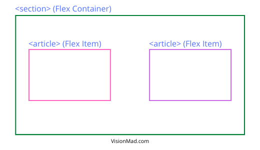

Flexbox also known as Flexible box gives you complete control over the alignment, direction, order, and size of the boxes. It makes it very easy to build modern web page layouts.

## What is Flexbox?
Flex is one of the values for the CSS display property. Flexbox uses **flex containers** and **flex items** to define the positioning and layout.

- Flex Container: The element with display property set to flex becomes the **```Flex Container```**.
- Flex Items: All direct child of the flex container becomes the **```Flex Items```**.

HTML
```html
<section class="container">
  <article>Article 1</article>
  <article>Article 2</article>
</section>
```

CSS
```css
.container {
  display: flex;
}
```

In the above example, ```<section>``` with class container is the flex container and it's direct ```<article>``` childrens are the flex items.



Display flex tells the browser that the container element should be rendered with flexbox instead of the default box model. The default befaviour of display flex is to align all the flex items in a row.

## Row alignment with Justify-Content
Justify content property (used on the flex container) defines the horizontal alignment of its items. Justify content have the following values.

- **center**: Align flex items at the row center.
- **flex-start**: Align flex items at the row start.
- **flex-end**: Align flex items at the row end.
- **space-around**: Evenly distributes the space around each flex item.
- **space-between**: Evenly distributes the space between each flex item.

Here is an example to align flex items at the row center.

```css
.container {
  display: flex;
  justify-content: center;
}
```

Play around with the interactive example below to see how different values of **justify-content** works with display flex. Click pink colored buttons to change the property values.

**Justify Content Example**
<iframe src="https://codesandbox.io/embed/flex-justify-content-example-9yzlx?fontsize=14&hidenavigation=1&theme=dark"
  style="width:100%; height:500px; border:0; border-radius: 4px; overflow:hidden;"
  title="flex justify-content example"
  allow="accelerometer; ambient-light-sensor; camera; encrypted-media; geolocation; gyroscope; hid; microphone; midi; payment; usb; vr; xr-spatial-tracking"
  sandbox="allow-forms allow-modals allow-popups allow-presentation allow-same-origin allow-scripts"
></iframe>

## Column alignment with Align-Items
Align items property (used on the flex container) defines the vertical alignment of its items. Values for align-items are similar to that of justify-content.

- **center**: Align flex items at the column center.
- **flex-start**: Align flex items at the column top.
- **flex-end**: Align flex items at the column bottom.
- **stretch**: Each flex item extends to the full height of the flex container. Useful to create equal height columns with variable amount of content in each one.
- **baseline**: Items are aligned such as their baselines align.

Here is an example to align flex items at the column center.

```css
.container {
  display: flex;
  align-items: center;
}
```

Play around with the interactive example below to see how different values of **align-items** works with display flex. Click pink colored buttons to change the property values.

**Align Items Example**
<iframe src="https://codesandbox.io/embed/flex-align-items-example-zyqzs?fontsize=14&hidenavigation=1&theme=dark"
  style="width:100%; height:500px; border:0; border-radius: 4px; overflow:hidden;"
  title="flex align-items example"
  allow="accelerometer; ambient-light-sensor; camera; encrypted-media; geolocation; gyroscope; hid; microphone; midi; payment; usb; vr; xr-spatial-tracking"
  sandbox="allow-forms allow-modals allow-popups allow-presentation allow-same-origin allow-scripts"
></iframe>

## Create a grid with Flex-Wrap
When flex-items row width exceds the width of flex-container, flex-items flow off the edge of the container. This behaviour can be changed with **flex-wrap** property (used on the flex-container). Flex-Wrap have only two values:

- **no-wrap**: this is the default value. Flex items flow off the page.
- **wrap**: this will wrap the flex-items on the next line and creates a grid.

```css
.container {
  display: flex;
  justify-content: center;
  flex-wrap: wrap;
}
```

If you want to make a grid with flex-wrap, make sure to give flex-items a min-width, else flex-items will shrink to fit the container.

Here is a live interactive example for flex-wrap.

**Flex Wrap Example**
<iframe src="https://codesandbox.io/embed/flex-justify-content-example-forked-1iib7?fontsize=14&hidenavigation=1&theme=dark"
  style="width:100%; height:500px; border:0; border-radius: 4px; overflow:hidden;"
  title="flex wrap example"
  allow="accelerometer; ambient-light-sensor; camera; encrypted-media; geolocation; gyroscope; hid; microphone; midi; payment; usb; vr; xr-spatial-tracking"
  sandbox="allow-forms allow-modals allow-popups allow-presentation allow-same-origin allow-scripts"
></iframe>