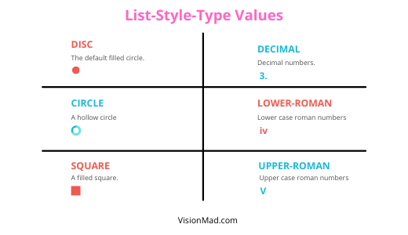

Lists are very important part of HTML which lets you display data in a list format. Think of a todo list or navigational links, they are all HTML lists. In this lesson you will learn how to create and style HTML lists.

## Creating Lists
HTML gives you three types of lists to work with: **unordered, ordered, and description list**.

### **Unordered List**
Unordered list is the list of items where the order of items does not matter. For example a shopping list. For unordered list **```<ul>```** element is used and each list is wrapped in **```<li>```** (list item) element.

```html
<ul class="shopping-list">
  <li>Milk</li>
  <li>Bread</li>
  <li>Eggs</li>
  <li>Chocolates</li>
</ul>
```

RESULT
<ul>
  <li>Milk</li>
  <li>Bread</li>
  <li>Eggs</li>
  <li>Chocolates</li>
</ul>

### **Ordered List**
Ordered list is similar to unordered list, the only difference being that here the order of items does matter. For example a set of instructions to follow. For ordered list **```<ol>```** element is used with **```<li>```** element for each item.

```html
<ol class="dc-movie-order">
  <li>The Dark Knight</li>
  <li>Man Of Steel</li>
  <li>Wonder Woman</li>
  <li>Justice League - Snyder Cut</li>
</ol>
```

Watch DC movies in the following order.
<ol class="dc-movie-order">
  <li>The Dark Knight</li>
  <li>Man Of Steel</li>
  <li>Wonder Woman</li>
  <li>Justice League - Snyder Cut</li>
</ol>

#### **Start Attribute**
Start attribute defines the number from which an ordered list should start.

```html
<ol start="25">
  <li>The Dark Knight</li>
  <li>Man Of Steel</li>
  <li>Wonder Woman</li>
  <li>Justice League - Snyder Cut</li>
</ol>
```

#### **Reversed Attribute**
Reversed attribute reverses the entire order of the list items. It displays the list in a descending order.

```html
<ol reversed>
  <li>The Dark Knight</li>
  <li>Man Of Steel</li>
  <li>Wonder Woman</li>
  <li>Justice League - Snyder Cut</li>
</ol>
```

RESULT
<ol reversed>
  <li>The Dark Knight</li>
  <li>Man Of Steel</li>
  <li>Wonder Woman</li>
  <li>Justice League - Snyder Cut</li>
</ol>

#### **Value Attribute**
Value attribute allows you to specifically set order of an indivisual list item.

```html
<ol>
  <li>The Dark Knight</li>
  <li value="5">Man Of Steel</li>
  <li>Wonder Woman</li>
  <li>Justice League - Snyder Cut</li>
</ol>
```

RESULT
<ol>
  <li>The Dark Knight</li>
  <li value="5">Man Of Steel</li>
  <li>Wonder Woman</li>
  <li>Justice League - Snyder Cut</li>
</ol>

### **Description List**
Description list lets you have description for each item in the list. For description list **```<dl>```** element is used with **```<dt>```** element for the list item and **```<dd>```** element for the list description.

Description list is not used as often as ordered or unordered list.

```html
<dl>
  <dt>SuperMan</dt>
  <dd>
    Clark Kent is an alien from a planet named krypton. But he found his place on earth among the humans. He is the ultimate SuperHero.
  </dd>

  <dt>BatMan</dt>
  <dd>
    Bruce Wayne is a billionaire businessman. Give him the prepration time and he will be able to trouble even the God level creatures.
  </dd>

  <dt>Wonder Woman</dt>
  <dd>
    Diana, the daughter of Zeus is a GOD. She fought her own evil brother to save the planet earth from his wishful thinking.
  </dd>
</dl>
```

RESULT: Description list of superheros.
<dl>
  <dt>SuperMan</dt>
  <dd style="margin: 10px">
    Clark Kent is an alien from a planet named krypton. But he found his place on earth among the humans. He is the ultimate SuperHero.
  </dd>

  <dt>BatMan</dt>
  <dd style="margin: 10px">
    Bruce Wayne is a billionaire businessman. Give him the prepration time and he will be able to trouble even the God level creatures.
  </dd>

  <dt>Wonder Woman</dt>
  <dd style="margin: 10px">
    Diana, the daughter of Zeus is a GOD. She fought her own evil brother to save the planet earth from his wishful thinking.
  </dd>
</dl>

## Styling Lists
Now you know how to create all sorts of lists. So, lets take a look at how you can style any HTML list.

### **List Style Type**
With **list-style-type** property you can style the list item marker. By default the list item marker for unordered list is a filled circle (disc). Here is an example of changing the default marker to a square.

HTML
```html
<ul class="square-marker">
  <li>List item 1</li>
  <li>List item 2</li>
  <li>List item 3</li>
</ul>
```

CSS
```css
.square-marker {
  list-style-type: square;
}
```

RESULT
<ul class="square-marker" style="list-style-type: square;">
  <li>List item 1</li>
  <li>List item 2</li>
  <li>List item 3</li>
</ul>

Here are the list of major values for list-style-type property.



### **Using image as a List Item Marker**
Yes, it is possible. You can also set list item market as an image. Set the list-item-type for li as none, and set the image url in background property.

HTML
```html
<ul>
  <li class="orange">Orange</li>
  <li class="apple">Apple</li>
  <li class="grappes">Grappes</li>
</ul>
```

CSS
```css
  .orange {
    background: url("image-path");
    background-position: 0 50%;
    background-repeat: no-repeat;
    padding: 10px;
  }

  /* Similarly set for apple and grappes */
```

RESULT
<ul style="list-style-type: none;">
  <li style="background: url(https://5.imimg.com/data5/VN/YP/MY-33296037/orange-600x600-500x500.jpg); background-position: 0 50%; background-size: 25px; background-repeat: no-repeat; padding: 30px;">Orange</li>
  <li style="background: url(https://www.applesfromny.com/wp-content/uploads/2020/05/Jonagold_NYAS-Apples2.png); background-position: 0 50%; background-size: 35px; background-repeat: no-repeat; padding: 30px;">Apple</li>
  <li style="background: url(https://i.pinimg.com/originals/e6/8d/cc/e68dccd48cd7b45056a8fa5bd21047e2.png); background-position: 0 50%; background-size: 25px; background-repeat: no-repeat; padding: 30px;">Grappes</li>
</ul>

This was all about creating and styling all sorts of HTML lists.

<hr />

This lesson was pretty much fun. Build your lists and do share with us on [Twitter](https://twitter.com/visionmadHQ). And please support us by sharing our lessons.

Thank You!