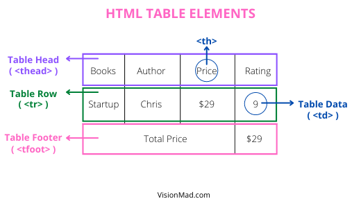

In this lesson you will learn to organize and style infromational data in a tabular format with HTML tables.

## The Table Markup
Tables presents data in rows and columns format. HTML provides various elements to create a table. Starting with a **```<table>```** element. HTML tables can be defined in 3 parts.

1. Table Head (**```<thead>```**)
2. Table Body (**```<tbody>```**)
3. Table Footer (**```<tfoot>```**)

Here is an image showing all 3 parts of the table.



### **Table Rows**
Each of those 3 parts wraps table row (**```<tr>```**) elements. Which defines content in each row.

### **Table Data**
Table data defines content in each cell of the row. Two elements **```<th>```** and **```<td>```** are used. Both elements works the same way, the only difference is in semantics.

- **`<th>`** are used for the content in cell of rows of **table head**.
- **`<td>`** are used for the content in cell of rows of **table body**.

### **Table Head**
Table head defines the heading for each column.

```html
<table> <!-- Table -->
  <thead> <!-- Table's Head -->
    <tr> <!-- Table's Head's Row -->
      <th>Book</th> 
      <th>Author</th>
      <th>Price</th> <!-- Table's Head's Row's Cell-3 -->
      <th>Rating</th>
    </tr>
  </thead>
</table>
```

### **Table Body**
Table body is where the main content lies. It fills the data in each cell.

```html
<table>
  <thead>
    ...
  </thead>

  <tbody> <!-- Table body -->
    <tr> <!-- Table body's row-1 -->
      <td>$100 dollar startup</td>
      <td>Chris Guillebeau</td>
      <td>$29</td> <!-- Table body row-1 cell-3 -->
      <td>9/10</td>
    </tr>

    <tr> <!-- Table body's row2 -->
      <td>The lean startup</td>
      <td>Eric Ries</td>
      <td>$15</td> <!-- Table body row-2 cell-3 -->
      <td>8/10</td>
    </tr>

    <tr> <!-- Table body's row3 -->
      <td>Zero to One</td>
      <td>Peter Thiel</td>
      <td>$25</td> <!-- Table body row-3 cell-3 -->
      <td>7/10</td>
    </tr>
  </tbody>
</table>
```

Under table body (**`<tbody>`**) use table row (**`<tr>`**) as many times as you want to create a new row.

### **Table Footer**
Table footer contains data that outlines the content of table.

```html
<table>
  <thead>...</thead>
  <tbody>...</tbody>
  <tfoot>
    <tr>
      <td>Price Total</td>
      <td></td>
      <td></td>
      <td>$69</td>
    </tr>
  </tfoot>
</table>
```

RESULT: Here is the result of complete table markup.
<div style="border: 1px solid black; padding: 5px;">
  <table>
    <thead>
      <tr>
        <th scope="col">Book</th> 
        <th scope="col">Author</th>
        <th scope="col">Price</th>
        <th scope="col">Rating</th>
      </tr>
    </thead>
    <tbody>
      <tr>
        <td>$100 dollar startup</td>
        <td>Chris Guillebeau</td>
        <td>$29</td>
        <td>9/10</td>
      </tr>
      <tr>
        <td>The lean startup</td>
        <td>Eric Ries</td>
        <td>$15</td>
        <td>8/10</td>
      </tr>
      <tr>
        <td>Zero to One</td>
        <td>Peter Thiel</td>
        <td>$25</td>
        <td>7/10</td>
      </tr>
    </tbody>
    <tfoot>
      <tr>
        <td>Price Total</td>
        <td></td>
        <td></td>
        <td>$69</td>
      </tr>
    </tfoot>
  </table>
</div><br />

## Styling The Table
The above table doesn't look much appealing and that's our next job. You can add borders, table striping, and text alignment within the table.

### **Table Borders**
Border can be added to all elements of table. You should add borders as per your design needs.

#### **Border-Collapse**
By default border of table is stacked with border of rows which makes the table border thicker than the border-width provided. To overcome this behaviour set value of border-collapse to **`collapse`**. Default value of border-collapse is **`separate`**.

```css
table {
  border-collapse: collapse;
}

th,
td {
  border: 1px solid black;
  padding: 10px 15px;
}
```

<style>
  .table-style {
    border-collapse: collapse;
  }

  .th-style,
  .td-style {
    border: 1px solid black;
    padding: 10px 15px;
  }
</style>
<div style="border: 1px solid black; padding: 5px;">
  <table class="table-style">
    <thead>
      <tr>
        <th class="th-style" scope="col">Book</th> 
        <th class="th-style" scope="col">Author</th>
        <th class="th-style" scope="col">Price</th>
        <th class="th-style" scope="col">Rating</th>
      </tr>
    </thead>
    <tbody>
      <tr>
        <td class="td-style">$100 dollar startup</td>
        <td class="td-style">Chris Guillebeau</td>
        <td class="td-style">$29</td>
        <td class="td-style">9/10</td>
      </tr>
      <tr>
        <td class="td-style">The lean startup</td>
        <td class="td-style">Eric Ries</td>
        <td class="td-style">$15</td>
        <td class="td-style">8/10</td>
      </tr>
      <tr>
        <td class="td-style">Zero to One</td>
        <td class="td-style">Peter Thiel</td>
        <td class="td-style">$25</td>
        <td class="td-style">7/10</td>
      </tr>
    </tbody>
    <tfoot>
      <tr>
        <td class="td-style">Price Total</td>
        <td class="td-style"></td>
        <td class="td-style"></td>
        <td class="td-style">$69</td>
      </tr>
    </tfoot>
  </table>
</div><br />

#### **Border-Spacing**
Border spacing provides specified amount of spacing between the borders.

```css
table {
  border-collapse: separate;
  border-spacing: 4px;
}
table,
th,
td {
  border: 1px solid black;
}
th,
td {
  padding: 10px 15px;
}
```

Table example with border spacing.
<style>
  .table-space {
    border-collapse: separate;
    border-spacing: 4px;
  }
  .table-space,
  .th-space,
  .td-space {
    border: 1px solid black;
  }
  .th-space,
  .td-space {
    padding: 10px 15px;
  }
</style>
<div style="border: 1px solid black; padding: 5px;">
  <table class="table-space">
    <thead>
      <tr>
        <th class="th-space" scope="col">Book</th> 
        <th class="th-space" scope="col">Author</th>
        <th class="th-space" scope="col">Price</th>
        <th class="th-space" scope="col">Rating</th>
      </tr>
    </thead>
    <tbody>
      <tr>
        <td class="td-space">$100 dollar startup</td>
        <td class="td-space">Chris Guillebeau</td>
        <td class="td-space">$29</td>
        <td class="td-space">9/10</td>
      </tr>
      <tr>
        <td class="td-space">The lean startup</td>
        <td class="td-space">Eric Ries</td>
        <td class="td-space">$15</td>
        <td class="td-space">8/10</td>
      </tr>
      <tr>
        <td class="td-space">Zero to One</td>
        <td class="td-space">Peter Thiel</td>
        <td class="td-space">$25</td>
        <td class="td-space">7/10</td>
      </tr>
    </tbody>
    <tfoot>
      <tr>
        <td class="td-space">Price Total</td>
        <td class="td-space"></td>
        <td class="td-space"></td>
        <td class="td-space">$69</td>
      </tr>
    </tfoot>
  </table>
</div><br />

As per your requirement you can experiment with adding borders to different table elements.

### **Table Striping**
You can add background color to alternative rows. This is called table striping.

Set background of even row to a color. Use **`:nth-child()`** selector to set background of alternative rows.

```css
tbody tr:nth-child(2) {
  background: #red;
}
```

Above snippet will set background of 2nd row to red.

```css
tbody tr:nth-child(odd) {
  background: aqua;
}
```

Above snippet will set background of every alternative row to #f0f0f2.

Here is an example of table striping.
<style>
  .table-striping {
    border-collapse: collapse;
  }
  .table-striping,
  .th-striping,
  .td-striping {
    border: 1px solid black;
  }
  .th-striping,
  .td-striping {
    padding: 10px 15px;
  }
  .tbody-striping .tr-striping:nth-child(odd) {
    background: aqua;
  }
</style>
<div style="border: 1px solid black; padding: 5px;">
  <table class="table-striping">
    <thead>
      <tr>
        <th class="th-striping" scope="col">Book</th> 
        <th class="th-striping" scope="col">Author</th>
        <th class="th-striping" scope="col">Price</th>
        <th class="th-striping" scope="col">Rating</th>
      </tr>
    </thead>
    <tbody class="tbody-striping">
      <tr class="tr-striping">
        <td class="td-striping">$100 dollar startup</td>
        <td class="td-striping">Chris Guillebeau</td>
        <td class="td-striping">$29</td>
        <td class="td-striping">9/10</td>
      </tr>
      <tr class="tr-striping">
        <td class="td-striping">The lean startup</td>
        <td class="td-striping">Eric Ries</td>
        <td class="td-striping">$15</td>
        <td class="td-striping">8/10</td>
      </tr>
      <tr class="tr-striping">
        <td class="td-striping">Zero to One</td>
        <td class="td-striping">Peter Thiel</td>
        <td class="td-striping">$25</td>
        <td class="td-striping">7/10</td>
      </tr>
    </tbody>
    <tfoot>
      <tr>
        <td class="td-striping">Price Total</td>
        <td class="td-striping"></td>
        <td class="td-striping"></td>
        <td class="td-striping">$69</td>
      </tr>
    </tfoot>
  </table>
</div><br />

<hr />

With this lesson we came to the end of our HTML / CSS course. And remember consistent deliberate practise is the key to master any skill.

We are also preparing video lessons on building completely responsive websites with HTML and CSS. So, stay tuned and subscribe to the news letter for updates.

Thank You!