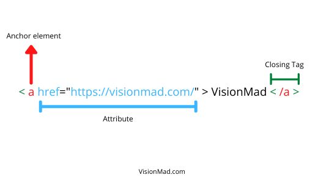
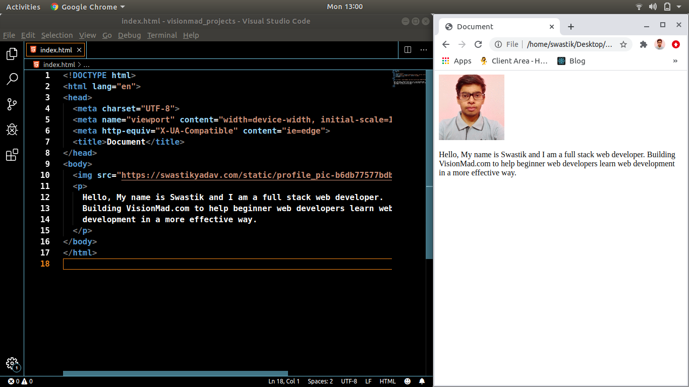

Before you start writing HTML it is important to understand the syntax and common terms used in HTML. In this lesson, you will learn what is HTML and what are the 3 building blocks of HTML.

## What is HTML?
HTML stands for "HyperText Markup Language". It is the structure of a web page, it gives meaning to the content of a webpage. All the texts, forms, and multi-media on a webpage are defined by HTML with tags like heading, input, image, video, etc.

## HTML Common Terms
There are 3 terminologies which are the building blocks of HTML.



### Elements
The element defines the type of content. Whether it is a paragraph, a heading, an image, or a form. For example, we define paragraphs with **p** element, headings with multiple levels of **h** element, links/anchor with **a** element, and images with **img** element.

### Tags
A tag is denoted by a less-than (<) and a greater-than (>) sign wrapped around an Element. Most elements have an opening tag (<>) and a closing tag (</>). The opening tag denotes the start of the Element and the Closing tag denotes the end of the Element.

Some elements like image and input don't need a closing tag. These are referred to as self-closing tags.

### Attributes
An attribute provides additional value to the element. The most commonly used attributes are class, id, src, and href. For example in an image tag source of the image is defined with the src attribute. And in an anchor element link to a different page is defined with a href attribute.

## HTML document type structure
HTML documents are files with .html file extension. Here is an example of HTML file structure.

```html
<!DOCTYPE html>
<html lang="en">
  <head>
    <meta charset="UTF-8">
    <meta name="viewport" content="width=device-width, initial-scale=1.0">
    <meta http-equiv="X-UA-Compatible" content="ie=edge">
    <title>Document</title>
  </head>
  <body>
    <p>Here goes all the visible content on the webpage.</p>
  </body>
</html>
```

- `<!DOCTYPE html>` informs the web browser that we are using the latest version of HTML.
- `<html>` element is the beginning and `</html>` is the end of the structure.
- `<head>` element contains information about the page. Like title and metadata. Content of the `<head>` element is not visible on the webpage.
- `<meta charset="utf-8">` specifies the character encoding of the page.
- Only content between the opening (`<body>`) and closing (`</body>`) body tag is visible on the webpage.

## Build the first page of your portfolio.
Throughout this course, you will build your complete portfolio website. So, let's start by building the first page with some info about you.

1. Create a folder named **portfolio_project** in your desktop.
2. In that folder create two files one with .html extension (index.html) and other with .css extension (index.css).
```bash
portfolio_project
│   index.html
│   index.css
```
3. Open the **portfolio_project** in your code editor and define doctype structure in your index.html file.
```html
  <!DOCTYPE html>
  <html lang="en">
    <head>
      <meta charset="UTF-8">
      <meta name="viewport" content="width=device-width, initial-scale=1.0">
      <meta http-equiv="X-UA-Compatible" content="ie=edge">
      <title>Document</title>
    </head>
    <body>

    </body>
  </html>
```
4. Now, add some info about yourself in the body with paragraph (**p**) tag. And open the index.html file in your web browser.


Congrats, you just created your first webpage.

<hr />

This was all you needed to know about HTML for now, going further you will learn a lot more about HTML. Next, you will get to know your CSS and Common Terms used in CSS.

To support us, please share this content.