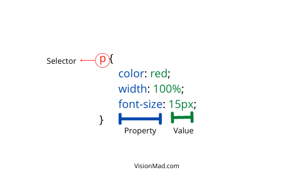

After getting an idea of what HTML is, Now is the time to get familiar with the common terms used in CSS. In this lesson, you will learn what is CSS and what are the most commonly used terms in CSS.

## What is CSS?
CSS stands for "Cascading Style Sheet". It handles the presentation and appearance of HTML elements on a webpage using fonts, colors, and positioning. Anything related to how an element should look and feel must be handled by CSS.

## CSS common terms.
There are 3 terminologies which are the building blocks of CSS. When you need to apply styles on an HTML element think of it as a 3 step process.



1. Select the element you want to style.
2. Specify which property of that element you want to change.
3. Specify the value of that property.

### **Selectors**
Selectors specify which HTML element or elements need to be styled. You may want to increase the font size of all paragraph elements or you may just want to change the color of a specific paragraph element. Selectors help you select the element you want to target.

#### Most common types of selectors.
1. ##### **Type Selector**
With type selectors you can directly target the elements with their name.

```css
p {
  color: red;
  width: 80%;
  font-size: 16px;
}
```

2. ##### **Class Selector**
With class selectors you can target elements by their class attribute. Use class selectors when you need to apply same stylings to multiple elements. In CSS file we denote class with a (.) followed by the class attribute name.

HTML
```html
<p class="para">This is a paragraph element 1</p>
<p class="para">This is a paragraph element 2</p>
```

CSS
```css
.para {
  color: red;
  width: 80%;
  font-size: 16px;
}
```

3. ##### **ID Selectors**
With ID selectors you can target an element by it's ID attribute. Their can not be multiple ID attribute with the same name. Use ID selector to apply unique styling to an element. In CSS file ID attribute is denoted by (#) followed by the ID name.

HTML
```html
<p id="red-background">This is a paragraph element</p>
```

CSS
```css
#red-background {
  background: red;
}
```

### **Properties**
This determines what property of the selected element needs to be changed. You may want to change the color, font-size, background, height, or weight of the paragraph element.

Color, font-size, background, weight, and height are just a few properties to name.

### **Values**
This defines the value you want to set for the property of an element. For the color property, you can set the value to red, green, blue, or any other color.

Say you want to change the color of a paragraph element to red. Here paragraph element is the selector, color is the property, and red is the value of that property.

## Connecting HTML and CSS.
How do you get your HTML and CSS to talk to each other? By referencing CSS in your HTML.

HTML and CSS are separate technologies and they should remain that way. You should not write CSS in HTML and vice versa. The best practice is to reference the CSS file in the head of the HTML file with a link element.

```html
<html>
  <head>
    <link rel="stylesheet" href="style.css">
  </head>
</html>
```

## Cross-browser compatibility with CSS Resets.
Every web browser has its default settings for different elements. So, to ensure cross-browser compatibility (ensuring that your website looks the same on all browsers) CSS resets are widely used. It resets all the default browser settings to zero so that you can define your default styling for different elements.

CSS reset code needs to be at the top of the CSS file due to cascading reasons. You will learn more about cascading.

[Eric Meyer's reset](https://meyerweb.com/eric/tools/css/reset/) is one of the most popular CSS reset. Copy the provided CSS code from [Eric Meyer's reset](https://meyerweb.com/eric/tools/css/reset/) and paste (along with the credit to Eric Meyer) it at the top of your CSS file.

```css
/* http://meyerweb.com/eric/tools/css/reset/ 
   v2.0 | 20110126
   License: none (public domain)
*/

html, body, div, span, applet, object, iframe,
h1, h2, h3, h4, h5, h6, p, blockquote, pre,
a, abbr, acronym, address, big, cite, code,
del, dfn, em, img, ins, kbd, q, s, samp,
small, strike, strong, sub, sup, tt, var,
b, u, i, center,
dl, dt, dd, ol, ul, li,
fieldset, form, label, legend,
table, caption, tbody, tfoot, thead, tr, th, td,
article, aside, canvas, details, embed, 
figure, figcaption, footer, header, hgroup, 
menu, nav, output, ruby, section, summary,
time, mark, audio, video {
	margin: 0;
	padding: 0;
	border: 0;
	font-size: 100%;
	font: inherit;
	vertical-align: baseline;
}
/* HTML5 display-role reset for older browsers */
article, aside, details, figcaption, figure, 
footer, header, hgroup, menu, nav, section {
	display: block;
}
body {
	line-height: 1;
}
ol, ul {
	list-style: none;
}
blockquote, q {
	quotes: none;
}
blockquote:before, blockquote:after,
q:before, q:after {
	content: '';
	content: none;
}
table {
	border-collapse: collapse;
	border-spacing: 0;
}
```

You can also create a separate CSS file for resets and reference it in the head of your HTML before referencing other CSS files.

## Add CSS Reset to your portfolio project.
In last lesson you build the first page of your portfolio. Now it is time for you to add CSS Reset.

1. Create a new file under portfolio_project directory as resets.css and reference it in head of index.html.
```css
    <html>
      <head>
        <link rel="stylesheet" href="resets.css">
      </head>
    </html>
```
2. Copy Eric Meyer's reset code and paste in the resets.css file.

<hr />

This was all about CSS common terms. You should go through these lessons multiple times to understand it better.

To support us, please share this content.