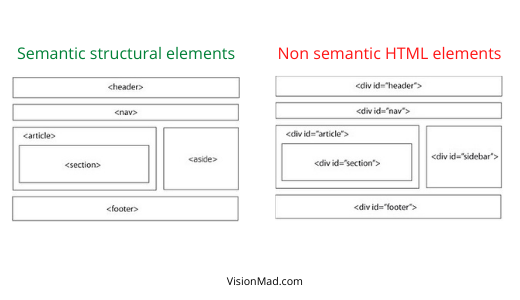

Semantic elements are very important part of HTML5, which defines the purpose of an element and it makes your code readable for both humans and machines. Prior to HTML5 developers used **class** attribute on **div** and **span** elements to specify the purpose of an element.

For example, here is how you would add **footer** to a page prior to HTML5.
```html
<body>
  <div class="footer">
    Ⓒ visionmad.com 2021
  </div>
</body>
```

And here is how you should do it now with semantic HTML5.
```html
<body>
  <footer>
    Ⓒ visionmad.com 2021
  </footer>
</body>
```

## Why semantic elements?
There are several benefits of using tags that have semantic meaning. I have listed two major benefits below.

1. **Easier to read and understand**: It adds value to an element by clearly defining what each element is about.
2. **Accessibility**: It enables computers, screen readers, search engines, and other devices to read and understand the content on a web page.

## Text based semantic elements.
Text based semantic elements provides meaning and purpose to texts on your web page.

### Headings
Headings are used to define multi level titles of a topic. Headings are of 6 different levels from **`<h1>`** to **`<h6>`**. `<h1>` being the most important title and `<h6>` being the least important title.

```html
<body>
  <h1>Heading level 1</h1>
  <h2>Heading level 2</h2>
  <h3>Heading level 3</h3>
  <h4>Heading level 4</h4>
  <h5>Heading level 5</h5>
  <h6>Heading level 6</h6>
</body>
```
Here is how it looks on the web page.
> <h1>Heading level 1</h1>
> <h2>Heading level 2</h2>
> <h3>Heading level 3</h3>
> <h4>Heading level 4</h4>
> <h5>Heading level 5</h5>
> <h6>Heading level 6</h6>

### Paragraphs
<u>```As the name suggests, this is to add some paragraphs that mostly supports your headings.```</u> The last sentence that you read was a paragraph element.

```html
<body>
  <p>
    As the name suggests, this is to add some paragraphs that mostly supports your headings.
  </p>
</body>
```

### Strong
Strong element is used to make a text <u>**```bold```**</u>. Here is an example.

```html
<body>
  <p>
    Strong element is used to make a text <strong>bold</strong>.
  </p>
</body>
```

### Emphasis
Emphasis element is used to make a text <u>*```italic```*</u>. Here is an example.

```html
<body>
  <p>
    Emphasis element is used to make a text <em>italic</em>.
  </p>
</body>
```

## Structure based semantic elements.
These semantics denotes the structural intension of an element and adds structural value and meaning to it. Some of the most used and common structure based semantic elements are ```<header>```, ```<nav>```, ```<article>```, ```<section>```, ```<aside>```, and ```<footer>```.



The point to be noted here is that these elements behaves exactly like a ```<div>```. They do add a structural purpose to an element but you still have to rely on CSS to change their position and styling. For example the **```<aside>```** tag won't put the element on side of the page by default, that needs to be done by CSS.

### Header
The ```<header>``` element is used at the top of the page. It may contain a logo or a navigation element. Look at the top of this page, it have a header with a logo and a navigation.

```html
<header>...</header>
```

### Navigation
The ```<nav>``` element is used for navigation purposes. It contains a collection of links to other pages of the same website.

```html
<nav>...</nav>
```

### Article
The ```<article>``` element is used as an independent, self-contained content on the page which can be resused on other parts of the page as well.

You will see ```<article>``` and ```<section>``` together in next example.

### Section
The ```<section>``` element is used to group related content together. A section is a thematic grouping of content.

```html
<section>
  <p>Top Professional Profiles</p>
  <section>
    <p>Entrepreneurship</p>
    <article>Elon Musk</article>
    <article>Mukesh Ambani</article>
    <article>Ratan Tata</article>
  <section>
  <section>
    <p>SuperHeros</p>
    <article>SuperMan</article>
    <article>Wonder Woman</article>
    <article>BatMan</article>
  <section>
</section>
```

### Aside
The ```<aside>``` element is used to put content off to the left or right side of the page. For example a sidebar.

Again, it won't put the content on right or left of the page by default. It is just to define the purpose of the content. Positioning needs to be done with CSS.

```html
<aside>...</aside>
```

### Footer
The ```<footer>``` element is used at the bottom of the page to provide some additional links and information about the page or overall website. See the bottom of this page.

```html
<footer></footer>
```

## Use semantic elements in your Portfolio project.
With you knowledge of semantic elements in HTML, use it in your portfolio project to give elements some meaning and purpose.

```html
<body>
  <header>
    <h1>Swastik Yadav</h1>
    <nav>
      <a href="/">Blog</a>
      <a href="/">projects</a>
      <a href="/">resume</a>
    </nav>
  </header>
  
  <p>
    Hi, I'm Swastik. A college dropout Software Engineer, currently learning
    to build products. This is my personal space on the internet. I write my
    thoughts in form of blog on Technology, Startup, and Finance.
  </p>

  <footer>
    © 2021 by Swastik Yadav. All rights reserved.
  </footer>
</body>
```

<iframe src="https://codesandbox.io/embed/visionmad-portfolio-project-1-6hy45?fontsize=14&hidenavigation=1&theme=light"
  style="width:100%; height:500px; border:0; border-radius: 4px; overflow:hidden;"
  title="VisionMad - Portfolio Project 1"
  allow="accelerometer; ambient-light-sensor; camera; encrypted-media; geolocation; gyroscope; hid; microphone; midi; payment; usb; vr; xr-spatial-tracking"
  sandbox="allow-forms allow-modals allow-popups allow-presentation allow-same-origin allow-scripts"
></iframe>

Once you start writing CSS for this project it will start looking much better.

<hr />

You just learned a very important concept of the modern web development. In the next lesson you will learn about block vs inline element and hyperlinks.

Please share this content and course to support us.