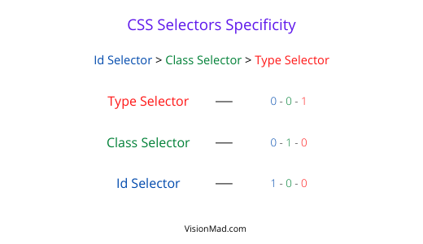
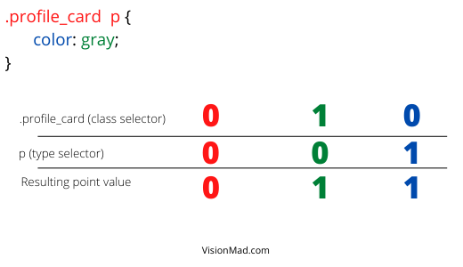
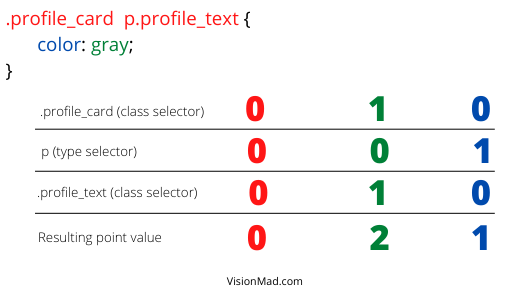

This lesson will teach you exactly how CSS decides to render styles by using the cascade.

## The Cascade
As CSS stands for **```cascading style sheet```**. Cascade is something arranged or occurring in a series or in a succession of stages. In CSS all styles are applied from top of the file to the bottom of the file.

For example, if you set background of a div twice the color from later will be applied.

```css
div {
  background: green;
}

div {
  background: blue;
}
```

Blue color is applied in the background of the div because it appears later in the cascade file.

## Calculating selectors specificity
The specificity of CSS selectors are defined by their point value. Type slector have lowest specificity with point value **0-0-1**, Class slector have medium specificity with point value **0-1-0**, and Id selector have highest specificity with point value **1-0-0**.



When a styling conflict occurs, the selector with higher specificity wins regardless of its place in the cascade file.

HTML
```html
<div class="div-class" id="div-id">I am a div</div>
```

CSS
```css
#div-id {
  background: red;
}

.div-class {
  background: green;
}

div {
  background: blue;
}
```

<iframe src="https://codesandbox.io/embed/serene-paper-oi1kt?fontsize=14&hidenavigation=1&theme=dark"
  style="width:100%; height:500px; border:0; border-radius: 4px; overflow:hidden;"
  title="CSS selectors specificity"
  allow="accelerometer; ambient-light-sensor; camera; encrypted-media; geolocation; gyroscope; hid; microphone; midi; payment; usb; vr; xr-spatial-tracking"
  sandbox="allow-forms allow-modals allow-popups allow-presentation allow-same-origin allow-scripts"
></iframe>

As per cascade background should be blue, but here specificity of ID took precedence regardless of its position in the cascade file because it has the highest specificity with point value **1-0-0**.

## Combined selectors specificity.
You can combine different selectors to achieve specific styling needs. First let's discuss what is combined selectors.

### Combination of selectors.
Say for example, you have a **```<section>```** element which contains multiple **```<p>```** elements. One of the ```<p>``` tag have a class name of ```profile_text```. With combined selectors you can target all ```<p>``` elements of that ```<section>``` or just the ```<p>``` element with the class name of ```profile_tag```.

HTML
```html
<section class="profile_card">
  <p>...</p>
  <p>...</p>
  <p class="profile_text">Web Developer</p>
</section>
```

CSS
```css
.profile_card p {
  color: gray;
}

.profile_card p.profile_text {
  color: aqua;
}
```

In the above CSS snippet there are two example of combined selctors.

1. First one with a class (profile_card) and a type (p) selector. This will style all ```<p>``` element under profile_card ```<section>```.
### Calculating combined specificity
#### Example 1

The resulting point value is **```0-1-1```**.

2. Second one with two class selectors (profile_card, profile_text) and one type selector (p). This will style only ```<p>``` element with profile_text class name under ```<section>``` element.

#### Example 2

The resulting point value is **0-2-1**.

That's how you combine selectors and calculate the specificity of combined selectors.

<hr />

Keep the specificity of different selectors in mind while writing CSS for your projects. On that note you came at the end of this lesson. In next lesson you will learn about being modular with multiple classes.

Please share this course and content to support us.