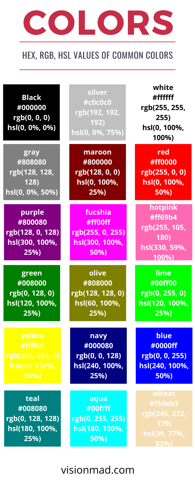

In this lesson you will learn about different ways of using colors and different length units in CSS.

## Colors in CSS.
Colors are extremly important part of web design and developemt. They represents subliminal message of the brand and website. You have 4 ways of using colors in you CSS.

- ### **Keyword (Direct color name)**
Keyword color values are direct name of the color you want to use. For example <span style="color: red">red</span>, <span style="color: green">green</span>, and <span style="color: blue">blue</span>.

- ### **Hexadecimals**
Hexadecimal consists of a **```#```** followed by six characters. These characters are numbers from **0 to 9** and letters from **a to f**. First two characters represents the shade of red, next two represents the shade of green, and the last two represents the shade of blue. You can mix various shades of red, green, and blue to create new colors, to be specific this permutation combination creates over **```16 million```** color options.

  >(10 number characters + 6 letter characters = 16 characters) appears in a pair of 3.
  > <br /><br />
  > (16 ^ 2) ^ 3 = 16.7 Million +

- ### **RGB**
RGB works similar to hexadecimals with various shades of red, green, and blue. RGB takes 3 number characters from **0 to 255**. 0 being the lightest shade and 255 being the darkest shade. Here is how Red, Green, and Blue is defined in RGB.

  <div style="width: 20px; height: 20px; background: #ff0000"></div>

  Red **```rgb(255, 0, 0)```**

  <div style="width: 20px; height: 20px; background: #00ff00"></div>

  Green **```rgb(0, 255, 0)```**

  <div style="width: 20px; height: 20px; background: #0000ff"></div>

  Blue **```rgb(0, 0, 255)```**

- ### **HSL**
HSL stands for Hue, Saturation, and Lightness. It takes three values just like rgb. The first value is plain number from **0 to 360** which represents the degree of color on the color wheel. Second value is saturation in percentage from 0% to 100%. It defines how saturated the color is. Third value is lightness also in percentage from 0% to 100%. It defines how light or dark the color is. Here is an example of Yellow color with hsl.

  <div style="width: 20px; height: 20px; background: hsl(60, 100%, 50%)"></div>

  Yellow **```hsl(60, 100%, 50%)```**

  Click <input type="color" /> to see a color picker in action.

  

Alright! Enough talk about colors. Going forward you will learn more about colors on your own. Now let's talk about Length units in CSS.

## Lengths Units
Length units in CSS are commonly used for width, height, and font-size. Length unit comes in two different forms absolute and relative length.

- ### **Absolute length units**
**Pixel** is the most popular absolute unit of measurment and is represented by **px** unit notation.

  To put things in prespective, you should know that a **pixel is 1 / 96th of an inch**. Pixels are mostly used to set font-size of texts and width of elements. Here is an example setting font-size of p element to 20px and width and height of div to 50px;

  ```css
  p {
    font-size: 20px;
  }

  div {
    width: 50px;
    height: 50px;
  }
  ```

- ### **Relative length units**
Relative length units are a bit more complex as they rely on device sizes and other units.

1. #### **Percentages**
Percentage on an element works relative to the parent of that element. If you want the width of a div to be half of its parent set it to 50%.

    ```css
    div {
      width: 50%;
    }
    ```

    Now when parent's width changes, width of the div element also changes relative to it.

2. #### **Em**
Em is relative to the element's font-size, 1em is equall to the font-size of the element. For example if font-size is 20px and width is set to 5em. The resulting width is (20 * 5) 100px.

    And when font-size is not specified for the element, em becomes relative to the closest parent with font-size specified.

    ```css
    .hero-section {
      font-size: 20px;
      width: 5em;
    }
    ```

    Thats was the basics of length units. And as in the case of colors, you will learn more about length units also on your own when you start using it.

<hr />

This lesson might have been too much for absolute beginners. But consistent and delibrate practise is the key. So keep pushing.

> You just keep pushing, you just keep pushing. I made every mistake that could be made. But I just kept pushing.
> <br /><br />
> -- Rene Descartes

Thank you so much for reading. Please support us by sharing our content.