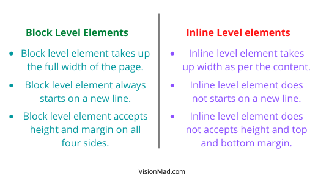
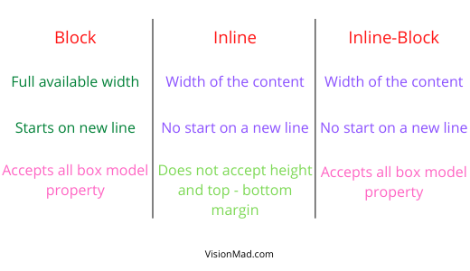

So far you learned about two types of HTML elements, block level and inline level elements. Now is the time to get familiar with the 3rd type called inline-block element. Before diving into the box model, you need to understand the CSS display property and options for it's value.

## CSS display options
Display property determines exactly how an element is displayed on the web page. Most commin options for value of display property are **block**, **inline**, **inline-block**, and **none**.

### **Block and Inline value**
Every HTML element have a default display property. Block level elements have display set to ```block``` and inline level element to ```inline``` by default. But you can overwrite the default display property. See the example below.

HTML
```html
<article class="block-element">I am article. Block level by default.</article>

<span class="inline-element">I am span. Inline level by default.</span>
```

CSS
```css
.block-element {
  display: inline; /* Overwritten */
  background: aqua;
}

.inline-element {
  display: block; /* Overwritten */
  background: hotpink;
}
```

See the result. A block element (```<article>```) now behaves like an inline element taking width which is only required by the content. And inline element (```<span>```) now behaves like a block element taking the entire available width.
<iframe src="https://codesandbox.io/embed/display-property-overwrite-default-xqsvm?fontsize=14&hidenavigation=1&theme=dark"
  style="width:100%; height:500px; border:0; border-radius: 4px; overflow:hidden;"
  title="display property overwrite default"
  allow="accelerometer; ambient-light-sensor; camera; encrypted-media; geolocation; gyroscope; hid; microphone; midi; payment; usb; vr; xr-spatial-tracking"
  sandbox="allow-forms allow-modals allow-popups allow-presentation allow-same-origin allow-scripts"
></iframe>

### **Introducing inline-block value**
Here is an image showing the difference between display **block** and display **inline**.



We have already discussed the first two points in an earlier lesson. So, let's discuss the 3rd point. **```You will get to know what is margin in a while. Till then think of it as a way to give spaces around an element.```**

- Block level element accepts height and margin on all four sides. There is no catch here.
- Inline level element does not accepts height and top - bottom margin. Height property, top, and bottom margin property does not work on inline level element.

That's where **```inline-block```** comes into play. it provides the best of both values (block and inline). With display property set to **inline-block** the element have all qualites of an inline element but now it also accepts height and top-bottom margin.



### **None value**
Setting the display property value to **none** will hide the element and the web page will appear as if the element was never there.

```css
div {
  display: none;
}
```

That's how display property and its value works to display an element on the web page.

<hr />

Next you will actually dive into the box model. Make sure you understand this module, as this module is extremly important to master the art of HTML and CSS.

The minimum you can do to support us is share this lesson. Thank you for reading.